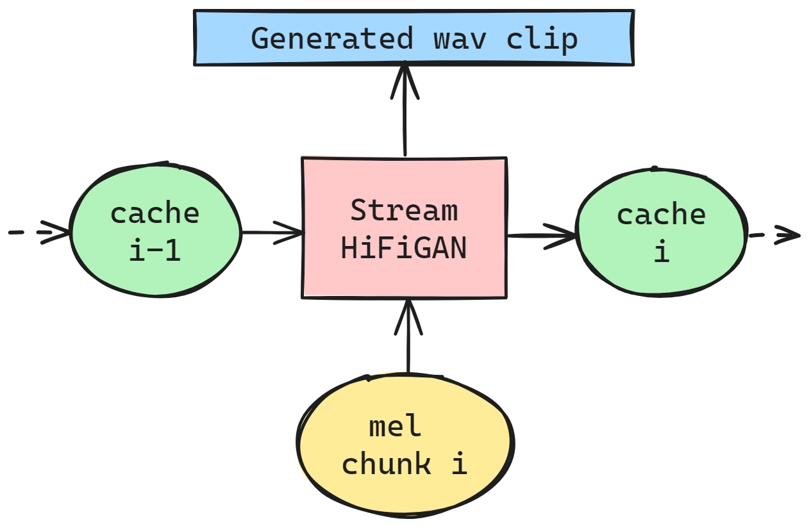

# StreamHiFiGAN

StreamHiFiGAN offers a HiFiGAN vocoder model optimized for streaming inference, providing real-time audio synthesis capabilities.



## Features

StreamHiFiGAN offers several benefits for audio synthesis, optimizing both performance and efficiency:

1. **No Requirement for Causal Convolutions**: The released model is designed to support streaming inference without the need for retraining, facilitating seamless adaptation.
2. **Latency Reduction**: By leveraging streaming inference, it significantly minimizes delays, thereby boosting real-time audio processing capabilities.
3. **Computational Efficiency**: Incorporates caching strategies to eliminate unnecessary recalculations during the streaming process.
4. **Seamless Speech Clip Concatenation**: Enables direct, seamless stitching of speech clips without the need for overlapping, recalculating, or interpolating, ensuring lossless audio synthesis.

These models are adapted from the work available at [ParallelWaveGAN](https://github.com/kan-bayashi/ParallelWaveGAN).

The converted models in ONNX format (conversion process not disclosed) are available under `dump/onnx/`. The following models are included:

- `csmsc_hifigan.v1`
- `jsut_hifigan.v1`
- `libritts_hifigan.v1`
- `ljspeech_hifigan.v1`
- `vctk_hifigan.v1`

To get the converted onnx models, visit [huggingface.co/OpenT2S/StreamHiFiGAN](https://huggingface.co/OpenT2S/StreamHiFiGAN).

## Streaming Inference

Use the following script to perform streaming inference:

```bash
for tag in ljspeech_hifigan.v1 jsut_hifigan.v1 csmsc_hifigan.v1 vctk_hifigan.v1 libritts_hifigan.v1; do
    if [[ "$tag" == "ljspeech_hifigan.v1" ]]; then
        sr=22050
        cd=3258
    else
        sr=24000
        cd=5687
    fi

    python stream_infer.py --dumpdir dump/sample/norm/$tag \
        --outdir dump/stream_synthesis/$tag/ \
        --onnx dump/onnx/$tag/stream_hifigan.cd${cd}.onnx \
        --cumulative-delay ${cd} --chunk-size 32 --sampling-rate ${sr}
done
```

## Usage of `stream_infer.py`

For more details on the parameters of `stream_infer.py`, use:

```bash
python stream_infer.py -h
```

This will display information on all available arguments, including directories for input features and output wav files, model file, and configuration details for streaming inference.

## Feature Extraction

Features under `dump/sample/norm/` are pre-extracted mel-spectrogram parameters. For method of feature extraction, refer to the `ParallelWaveGAN` project:

```bash
# To view all available pretrained models:
python << EOF
from parallel_wavegan.utils import PRETRAINED_MODEL_LIST
print(PRETRAINED_MODEL_LIST.keys())
EOF

# To download pretrained models:
for tag in ljspeech_hifigan.v1 jsut_hifigan.v1 csmsc_hifigan.v1 vctk_hifigan.v1 libritts_hifigan.v1; do
python << EOF
from parallel_wavegan.utils import download_pretrained_model
download_pretrained_model(${tag}, "pretrained_model")
EOF
done

# Process for feature extraction -> normalization -> synthesis:
for tag in ljspeech_hifigan.v1 jsut_hifigan.v1 csmsc_hifigan.v1 vctk_hifigan.v1 libritts_hifigan.v1; do
    if [[ "$tag" == "ljspeech_hifigan.v1" ]]; then
        sub="22k"
    else
        sub="24k"
    fi

    parallel-wavegan-preprocess \
        --config pretrained_model/${tag}/config.yml \
        --rootdir sample/${sub} \
        --dumpdir dump/sample/raw/$tag

    parallel-wavegan-normalize \
        --config pretrained_model/${tag}/config.yml \
        --rootdir dump/sample/raw/$tag \
        --dumpdir dump/sample/norm/$tag \
        --stats pretrained_model/${tag}/stats.h5

    parallel-wavegan-decode \
        --checkpoint pretrained_model/${tag}/checkpoint-2500000steps.pkl \
        --dumpdir dump/sample/norm/$tag \
        --outdir dump/synthesis/$tag
done
```
